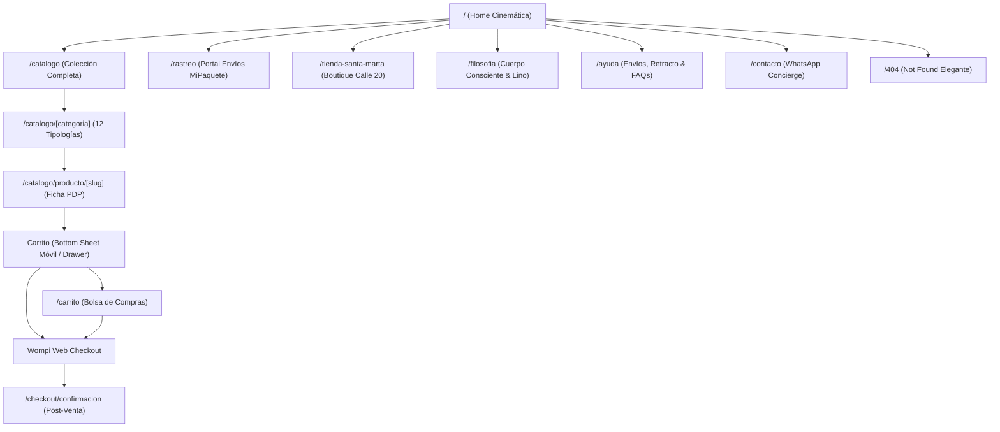

# 🌊 PLAN MAESTRO DE IMPLEMENTACIÓN MULTI-AGENTE: FRONTEND HEADLESS BAUTO RESORT WEAR
**Dominio Oficial:** `www.bauto.com.co`  
**Directorio de Trabajo:** `/Users/tomas/Library/CloudStorage/GoogleDrive-bautostudio@gmail.com/My Drive/VS/WEB`  
**Fecha de Creación:** 2026-09-28  
**Versión del Ecosistema:** 1.0 (Base v001)  
**Marco Normativo Obligatorio:** `.antigravityrules`, `BAUTO_MEMORY.md`, `BRAND_AND_DESIGN_SYSTEM.md`, `PROPUESTA_INTEGRACION_WEB_VERCEL_SHOPIFY_GAS.md`  

---

## 1. Contexto, Diagnóstico Baseline y Verificación Técnica

### 1.1 Estado del Backend (Certificado 100%)
El backend headless en `VS/WEB` se encuentra completamente construido, probado y auditado por 3 subagentes de investigación previa (0 errores en `node --check` sobre los 16 módulos TypeScript):
- **Capa de Datos:** `lib/sheets.ts` (Lectura en vivo de Master DB CSV con soporte dinámico de columnas, tallas XS a XXL y ÚNICA, slugificación y bandera `isExclusiveInStore` cuando `totalStock === 1`).
- **Gramática de Lujo y Moneda:** `lib/grammar.ts` (Diccionario canónico `ARTICULO_POR_TIPOLOGIA` ordenado por longitud descendente para evitar colisiones entre "pantaloneta" y "pantalón", formateo monetario COP sin decimales y generador de mensajes para WhatsApp Concierge).
- **Optimización de Imágenes:** `lib/images.ts` (Compresión WebP vía proxy `wsrv.nl` y conversión segura de URLs de Google Drive a CDN `lh3.googleusercontent.com`).
- **Estado Global Reactivo:** `lib/cartStore.ts` (Zustand con persistencia selectiva, sincronización multi-pestaña `BroadcastChannel('bauto_cart_channel')`, umbral de envío de cortesía $300.000 COP y ceremonia de regalo con dedicatoria en *'Lora' Italic*).
- **Motor Transaccional y Reservas:** `lib/redis.ts`, `/api/checkout/reserve`, `/api/checkout/wompi-session` (Two-Phase Soft Lock de 12 min / 720s en Upstash Redis, verificación de precios e integridad criptográfica SHA-256).
- **Webhook Blindado & Despacho M2M:** `/api/webhooks/wompi` (Validación SHA-256 en <50ms con timingSafeEqual, deduplicación atómica Redis `SETNX`, liberación de soft lock tras commit y despacho a `2. APPBAUTO` vía `registrarVentaServicioExterno` con `SECRETO_VENTA_SERVICIO`).
- **Servicios Satélite:** `/api/cron/reconcile` (conciliador cada 30 min), `/api/tracking` (MiPaquete V2 con storytelling caribeño), `/api/weather` (Open-Meteo Santa Marta en tiempo real), `/api/places/autocomplete` (Google Places Colombia), `/api/feed/google-shopping` (XML RSS 2.0) y `app/sitemap.ts` (Sitemap dinámico SEO).

### 1.2 Declaración de Infraestructura y No-Despliegue a GAS
> [!IMPORTANT]
> **Aislamiento Estricto:** La aplicación web `VS/WEB` está diseñada para ejecutarse y desplegarse exclusivamente en **Vercel** (`www.bauto.com.co`).  
> **NO se aplica `clasp push` ni despliegues en Google Apps Script para este repositorio.** El rol de Google Apps Script queda estrictamente reservado como backend de datos y motor operativo en `2. APPBAUTO` y `Master DB Sheets`.  
> Ningún archivo fuera de `VS/WEB` será modificado.

---

## 2. Sistema de Diseño, Tokens Globales y Ergonomía Móvil

Basado en `BRAND_AND_DESIGN_SYSTEM.md` y en la calibración empírica de `0. CATALOGUE/index.html` (L128-131):

### 2.1 Tipografía Canónica Oficial (Google Fonts)
| Rol en Interfaz | Familia Tipográfica | Pesos Autorizados | Variable CSS / Clase | Observación / Decisión |
| :--- | :--- | :--- | :--- | :--- |
| **Títulos y Encabezados** | `'Sora', sans-serif` | 600 (SemiBold), 700 (Bold), 800 (ExtraBold) | `--font-title` / `font-title` | Tipografía principal de catálogo web (activa en producción). En AppBauto convive con `Outfit`. |
| **Cuerpo, Formularios y Botones** | `'Plus Jakarta Sans', sans-serif` | 400 (Normal), 500 (Medium), 600 (SemiBold) | `--font-body` / `font-body` | Legibilidad ultra-limpia en móvil, sin deformaciones en textos condensados. |
| **Precios, Cifras y Números** | `'Rajdhani', sans-serif` | 600 (SemiBold), 700 (Bold) | `--font-mono` / `font-mono tabular-nums` | Cifras tabulares monoespaciadas para valores numéricos y SKUs. |
| **Acento Editorial, Slogan & Dedicatorias** | `'Lora', serif` | 600 (SemiBold Italic) | `--font-editorial` / `font-editorial italic` | Para citas poéticas del Caribe, mensajes de regalo y notas del taller. |

*Nota Crítica:* Se excluye explícitamente `Montserrat`, confirmando la decisión de diseño de preservar la coherencia exacta con el catálogo virtual activo.

### 2.2 Paleta Cromática y Materiales
```css
:root {
  /* Marca Primaria & Acentos */
  --color-terracota-ancestral: #B85C38; /* Botón primario y foco de acción */
  --color-terracota-intenso: #A04F2F;   /* Hover activo y sombras profundas */
  --color-verde-musgo: #7A8265;         /* Acento botánico secundario */
  --color-azul-oceano: #5E8B9D;         /* Mar Caribe, detalles de corte y brisa */
  --color-dorado-trigo: #D4A24E;        /* Exclusivo tienda física y sol tenue */
  --color-arena: #A89078;               /* Neutro cálido y costuras */
  --color-ciruela: #8A6E9B;             /* Acento sobrio de empaque */

  /* Neutros & Superficies */
  --bg-color: #FAF9F6;                  /* Blanco Nube / Fondo orgánico relajante */
  --color-perla: #F2F0EB;               /* Fondos de contenedores y cards */
  --text-primary: #1C1917;              /* Negro Carbón / Texto titular */
  --text-secondary: #78716C;            /* Gris Piedra / Subtítulos y metadatos */
  --glass-bg: rgba(255, 255, 255, 0.55);/* Vidrio esmerilado translúcido */
  --glass-border: rgba(255, 255, 255, 0.4);

  /* Semáforo & Estados */
  --success-color: #16A34A;
  --danger-color: #DC2626;
  --warning-color: #CA8A04;
}
```

### 2.3 Sistema de Botones BAUTO (10 Categorías Web)
1. **Cápsula Primaria Terracota (`.btn-pill-primary`):** Una por pantalla. Fondo Terracota Ancestral (`#B85C38`), texto blanco, radio `999px`. ("Añadir a la bolsa", "Pagar con Wompi").
2. **Cápsula Disco Vital (`.btn-pill-disc`):** Acción definitiva con disco iconográfico contrastante para el checkout final.
3. **Cápsula Vidrio Secundaria (`.btn-pill-glass`):** Superficie translúcida con desenfoque de fondo y borde sutil. ("Ver detalles", "Filtros").
4. **Círculo de Gesto (`.btn-round`):** 38px táctiles para interacciones atómicas (cerrar modal, cambiar cantidad, toggle de favoritos).
5. **Cápsula Discreta Terciaria (`.btn-pill-ghost`):** Sin borde ni fondo, texto con subrayado suave al hover ("Volver al catálogo", "Limpiar filtros").
6. **Selector de Talla / Segmento (`.btn-size-selector`):** Cápsulas interactivas con feedback táctil inmediato, indicación visual de stock bajo y bloqueo tachado elegante para tallas agotadas.

### 2.4 Ergonomía Móvil (Apple HIG & Emil Kowalski)
- **100dvh Estricto:** Contenedores de pantalla completa ajustados a Dynamic Viewport Height para evitar saltos provocados por la barra de navegación de Safari en iOS.
- **Safe Area Insets:** Respeto de `env(safe-area-inset-bottom)` y `env(safe-area-inset-top)` en barras fijas, drawers y modales.
- **Zona Táctil Ergonómica:** Mínimo de 44×44px en todos los botones y selectores táctiles.
- **Prevención de Zoom Automático en iOS:** Todos los campos de texto e inputs tendrán un tamaño base de `16px`.
- **Física de Resortes (Spring Motion):** Transiciones con curvas naturales (stiffness: 300, damping: 30) mediante `framer-motion`.
- **Microacústica Háptica:** Integración de la Web Audio API con síntesis nativa a -24dB (clic cálido de alta fidelidad al interactuar con el carrito, respetando el conmutador de silencio).

---

## 3. Árbol Canónico de Rutas y Navegación (12 Rutas)



### Detalle de las 12 Rutas del Sistema:
1. **`/` (Home Cinemática):**
   - Video hero con loop atmosférico de Santa Marta y lino en movimiento.
   - Widget en vivo del clima y brisa marina (`/api/weather`).
   - Sección *Curated Drops* (Últimos lanzamientos y piezas icónicas).
   - Módulo boutique con llamada a visitarnos en Santa Marta.
2. **`/catalogo` (Catálogo General):**
   - Filtros facetados por Ocasión (Playa, Atardecer, Noche, Fiesta), Tejido (Lino 100%, Algodón Noble, Seda, Bordado), Talla y Rango de Precio.
   - Ordenamiento por novedad, precio ascendente/descendente y disponibilidad.
   - Cuadrícula responsiva (2 columnas en móvil, 3-4 en desktop) con imágenes optimizadas WebP y efecto hover de caída textil.
3. **`/catalogo/[categoria]` (Páginas de Aterrizaje por Tipología):**
   - 12 landing pages dedicadas indexables para SEO: `camisa`, `pantalon`, `pantaloneta`, `bermuda`, `chaleco`, `chaqueta`, `kimono`, `polo`, `camiseta`, `short`, `jogger`, `accesorio`.
   - Encabezado editorial poético y micro-selección de piezas de la categoría.
4. **`/catalogo/producto/[slug]` (PDP Ficha de Prenda de Alta Costura):**
   - Galería de fotos 4K con zoom macro táctil.
   - Selector inteligente de tallas con lectura de existencias en tiempo real de Google Sheets.
   - Modal interactivo con **Guía de Medidas en cm** (pecho, cintura, cadera, largo).
   - **Ficha Sensorial Textil:** Gramaje (g/m²), grado de transparencia y sensación al tacto.
   - Etiquetado de *"Exclusiva en tienda física"* si stock = 1 en mostrador.
   - **Sticky Buy Bar (Móvil):** Barra pegajosa inferior que emerge al hacer scroll profundo con miniatura, selector y botón de compra directa.
5. **`/carrito` (Bolsa de Compras Dedicada):**
   - Alternativa de pantalla completa al Drawer/Bottom Sheet para visualización detallada.
   - Resumen de prendas, selector de cantidades con física de resorte.
   - Autocompletado de dirección colombiana vía `/api/places/autocomplete`.
   - Desglose transparente de envío ($15.000 COP o $0 COP si supera $300.000 COP).
   - Acceso al checkout de Wompi.
6. **`/checkout/confirmacion` (Página de Éxito Transaccional):**
   - Resumen formal de la orden validada por Wompi con número de referencia.
   - Estado de preparación en taller.
   - Enlace directo al portal `/rastreo` con el número de guía MiPaquete.
   - Botón directo al WhatsApp Concierge con la referencia pre-cargada.
7. **`/rastreo` (Portal Canónico de Seguimiento):**
   - Formulario de consulta por número de guía o cédula/celular.
   - Las 4 etapas del storytelling caribeño BAUTO conectadas a `/api/tracking`.
8. **`/tienda-santa-marta` (Boutique Física & Concierge):**
   - Dirección: Calle 20 # 2-36, Centro Histórico de Santa Marta.
   - Horarios de atención, fotos de taller y ambiente.
   - Mapa interactivo y botones nativos que abren Google Maps, Apple Maps o Waze con un solo toque.
9. **`/filosofia` (Cuerpo Consciente & Tejido):**
   - Manifiesto BAUTO: Movimiento del Trópico, Tejido de Reciprocidad y Confort Activo.
   - Guía de aprecio por la arruga noble del lino 100% y longevidad textil.
10. **`/ayuda` (Políticas, Envíos & Preguntas Frecuentes):**
    - Políticas de despacho nacional e internacional.
    - Derecho de retracto (Ley 1480 de 2011 de Colombia - 5 días hábiles).
    - Proceso de cambios de talla sin costo de flete en primer cambio.
11. **`/contacto` (Atención Personalizada):**
    - Enlace a WhatsApp con el Concierge VIP.
    - Canales de correo y formulario de atención directa.
12. **`/404` (`not-found.tsx`):**
    - Página elegante de prenda no encontrada con mensaje poético y botón de retorno al catálogo.

---

## 4. Análisis en 3 Capas (Secuencial y Obligatorio)

### Capa 1: Salud Técnica
- Arquitectura Next.js 14 App Router con estricta separación de **Server Components** (renderizado en servidor para SEO instantáneo y lectura directa de datos) y **Client Components** (`'use client'` solo en componentes interactivos: Carrito, selectores, modales).
- Cero advertencias de TypeScript (`strict: true`).
- Control de revalidación de caché (`next: { revalidate: 60 }` en catálogo y `noCache: true` en stock transaccional).
- Manejo robusto de errores con límites de error (`error.tsx`) y pantallas de suspensión (`loading.tsx`).

### Capa 2: Lógica Funcional
- Sincronización bidireccional entre la tienda local (`lib/cartStore.ts`) y el stock real en Google Sheets vía Soft Holds de 12 minutos en Upstash Redis.
- Escucha pasiva de eventos multi-pestaña con `BroadcastChannel` para actualizar instantáneamente el contador del carrito si el usuario abre otra pestaña.
- Autocompletado de direcciones en territorio colombiano evitando fallos en guías de mensajería.
- Apertura fluida de pasarela Wompi con firma criptográfica verificada en backend.

### Capa 3: Coherencia Estética & UI/UX
- Tipografía oficial estricta: `Sora` (títulos), `Plus Jakarta Sans` (cuerpo), `Rajdhani` (cifras/precios) y `'Lora' Italic` (dedicatorias de regalo).
- Paleta Resort Wear: Terracota Ancestral `#B85C38` como foco primario sobre fondos orgánicos Blanco Nube `#FAF9F6`.
- Microinteracciones de resorte y audio feedback táctil sutil a -24dB.
- Experiencia de bolsa de compras con barra de cortesía de flete ($300k COP) y opción de dedicatoria de regalo previsualizada en tiempo real.

---

## 5. Estructura Multi-Agente y 5 Bloques de Construcción

Para garantizar velocidad, aislamiento y revisión ciega sin sesgos, el desarrollo se divide en 5 agentes especializados con roles de implementador y auditor cruzado:

| Bloque | Enfoque Principal | Agente Implementador | Agente Revisor Ciego | Alcance de Archivos |
| :---: | :--- | :---: | :---: | :--- |
| **1** | **Cimientos, Layout Global & Navegación** | **Agente 1** *(Foundations Lead)* | **Agente 5** *(Blind QA Auditor)* | `tailwind.config.js`, `app/globals.css`, `app/layout.tsx`, `components/navigation/Navbar.tsx`, `components/navigation/Footer.tsx`, `components/navigation/WeatherWidget.tsx`, `lib/sound.ts` |
| **2** | **El Carrito & Flujo Transaccional** | **Agente 2** *(Cart & Checkout Lead)* | **Agente 1** *(Foundations Lead)* | `components/cart/Carrito.tsx`, `components/cart/CartItemRow.tsx`, `components/cart/FreeShippingBar.tsx`, `components/cart/GiftCeremony.tsx`, `components/cart/AddressAutocomplete.tsx`, `app/carrito/page.tsx`, `app/checkout/confirmacion/page.tsx` |
| **3** | **Escaparate Comercial & PDP Ficha de Prenda** | **Agente 3** *(Product & Catalog Lead)* | **Agente 2** *(Cart & Checkout Lead)* | `app/page.tsx`, `app/catalogo/page.tsx`, `app/catalogo/[categoria]/page.tsx`, `app/catalogo/producto/[slug]/page.tsx`, `components/product/SizeSelector.tsx`, `components/product/SizeGuideModal.tsx`, `components/product/StickyBuyBar.tsx`, `components/product/TextureMagnifier.tsx` |
| **4** | **Páginas Editoriales, Institucionales & Rastreo** | **Agente 4** *(Editorial & Support Lead)* | **Agente 3** *(Product & Catalog Lead)* | `app/rastreo/page.tsx`, `app/tienda-santa-marta/page.tsx`, `app/filosofia/page.tsx`, `app/ayuda/page.tsx`, `app/contacto/page.tsx`, `app/not-found.tsx` |
| **5** | **Auditor Ciego Integral de Acabados, iOS & QA** | **Agente 5** *(Blind QA Auditor)* | **Agente 4** *(Editorial Lead)* | Auditoría transversal multi-dispositivo, validación 100dvh en Safari iPhone, contraste WCAG AAA, `next build` limpio, física de resortes y micro-sonidos. |

---

## 6. Matriz de Riesgo y Zonas Protegidas

### 6.1 Zonas Protegidas (Intocables)
- **Repositorios Hermanos:** Queda terminantemente prohibido modificar archivos en `0. PLATFORM`, `1. PRODUCCIÓN`, `2. APPBAUTO`, `2. STOCK`, `3. VENTAS` o `0. CATALOGUE`.
- **Estructura de Master DB:** No se puede alterar el orden de columnas del Google Sheets (`ID`, `REFERENCIA`, `NOMBRE`, `PRECIO`, `CATEGORÍA`, `ESTADO`, `FOTO`, tallas `XS` a `XXL`).
- **Endpoints de Backend:** Los 16 archivos de `lib/` y `app/api/` ya certificados en `VS/WEB` son inmutables durante el desarrollo de la UI, salvo que se detecte un contrato roto que exija ajuste justificado.

### 6.2 Matriz de Riesgos Identificados y Mitigaciones
| Riesgo Identificado | Nivel | Acción de Mitigación |
| :--- | :---: | :--- |
| **Zoom indeseado en iPhone Safari** al tocar campos de autocompletado o dedicatoria. | **ALTO** | Configurar rigurosamente `text-base` (mínimo 16px) en todos los elementos `<input>` y `<textarea>`. |
| **Desfase del Drawer con la barra de navegación de iOS** (*Safari Bottom Bar*). | **ALTO** | Uso estricto de `100dvh` y `padding-bottom: max(1rem, env(safe-area-inset-bottom))`. |
| **Flashes de contenido sin estilo (FOUC) en tipografías.** | **MEDIO** | Carga optimizada vía `next/font/google` con `display: 'swap'` e inyección de variables CSS en el root. |
| **Desincronización de bolsa entre pestañas.** | **MEDIO** | Ya mitigado en `lib/cartStore.ts` con `BroadcastChannel`. Se conectará a un listener de ventana en el componente Navbar. |
| **Click accidental fuera del modal de guía de medidas perdiendo selección de talla.** | **BAJO** | El modal de medidas es puramente informativo y no muta el estado de selección de la ficha de producto. |

---

## 7. Desglose Detallado del Bloque 1 (Primer Paso a Ejecutar)

Una vez obtenida la autorización del usuario, se ejecutará el **Bloque 1** con el siguiente detalle de archivos y cambios:

### Tarea 1.1: Configuración de Tokens en `tailwind.config.js` y `app/globals.css`
- **Archivo:** `tailwind.config.js` (Creación)
  - Extensión de la paleta BAUTO: `terracota`, `musgo`, `oceano`, `arena`, `trigo`, `blanco-nube`, `perla`, `carbon`.
  - Configuración de fuentes: `font-title` (`Sora`), `font-body` (`Plus Jakarta Sans`), `font-mono` (`Rajdhani`), `font-editorial` (`Lora`).
  - Animaciones y keyframes para transiciones de resorte y fade-in.
- **Archivo:** `app/globals.css` (Creación)
  - Definición de variables `:root`.
  - Reseteo de scrollbar minimalista y soporte de `overscroll-behavior-y: contain`.
  - Clases utilitarias de vidrio esmerilado (`.glass-panel`, `.glass-header`).

### Tarea 1.2: Raíz de Aplicación con Fuentes Oficiales en `app/layout.tsx`
- **Archivo:** `app/layout.tsx` (Creación)
  - Inyección de Google Fonts con `next/font/google` (`Sora`, `Plus Jakarta Sans`, `Rajdhani`, `Lora`).
  - Configuración de metadatos SEO globales para BAUTO Resort Wear.
  - Inclusión del `Navbar` superior, contenedor de vistas y `Footer` global.
  - Montaje global del componente `Carrito` (Drawer / Bottom Sheet accesible desde cualquier pantalla).

### Tarea 1.3: Sistema de Micro-Audio Táctil en `lib/sound.ts`
- **Archivo:** `lib/sound.ts` (Creación)
  - Utilidad ligera basada en Web Audio API para reproducir un chasquido orgánico cálido a -24dB al interactuar con el carrito o botones primarios.
  - Bloqueo en dispositivos con modo silencio activo.

### Tarea 1.4: Barra de Navegación Global en `components/navigation/Navbar.tsx`
- **Archivo:** `components/navigation/Navbar.tsx` (Creación)
  - Glassmorphism translúcido con desenfoque de 20px.
  - Logotipo BAUTO con proporción áurea.
  - Enlaces de navegación: Colección, Santa Marta, Rastreo, Filosofía.
  - Widget del Clima de Santa Marta integrado (`WeatherWidget.tsx`).
  - Botón táctil "Carrito" con contador numérico animado reactivo a `lib/cartStore.ts`.
  - Menú hamburguesa ergonómico con animación de apertura para móvil.

### Tarea 1.5: Pie de Página Institucional en `components/navigation/Footer.tsx`
- **Archivo:** `components/navigation/Footer.tsx` (Creación)
  - Dirección física del taller y boutique en Santa Marta (Calle 20 # 2-36).
  - Horarios de atención comercial.
  - Enlaces rápidos de ayuda, derecho de retracto, términos, rastreo y redes sociales (`@bauto.studio`).
  - Mensaje de identidad: *"Prendas creadas bajo la brisa y la luz del Caribe colombiano"*.

---

## 8. Ledger de Tareas y Seguimiento de Implementación

| ID | Tarea | Estado | Responsable | Validación |
| :---: | :--- | :---: | :---: | :--- |
| **B1.1** | `tailwind.config.js` y `app/globals.css` | ✅ COMPLETADO | Agente 1 | Tokens oficiales y fuentes cargadas |
| **B1.2** | `app/layout.tsx` con fuentes y metadatos SEO | ✅ COMPLETADO | Agente 1 | Renderizado 100dvh sin errores |
| **B1.3** | `lib/sound.ts` (Micro-sonido háptico -24dB) | ✅ COMPLETADO | Agente 1 | Audio API nativa sin dependencias pesadas |
| **B1.4** | `components/navigation/Navbar.tsx` & `WeatherWidget.tsx` | ✅ COMPLETADO | Agente 1 | Responsive móvil y desktop, clima en vivo |
| **B1.5** | `components/navigation/Footer.tsx` | ✅ COMPLETADO | Agente 1 | Enlaces canónicos y datos de boutique |
| **B1.R** | Revisión Ciega del Bloque 1 | ✅ COMPLETADO | Agente 5 | Aprobación unánime: Build limpio (0 errores) |
| **B2.1** | `components/cart/Carrito.tsx` (Drawer & Bottom Sheet) | ✅ COMPLETADO | Agente 2 | Gesto de deslizamiento y responsive iOS |
| **B2.2** | `components/cart/FreeShippingBar.tsx` ($300k COP) | ✅ COMPLETADO | Agente 2 | Barra de progreso reactiva en Terracota |
| **B2.3** | `components/cart/GiftCeremony.tsx` ('Lora' Italic) | ✅ COMPLETADO | Agente 2 | Previsualización en vivo de dedicatoria |
| **B2.4** | `app/carrito/page.tsx` & `AddressAutocomplete.tsx` | ✅ COMPLETADO | Agente 2 | Formulario de envío y enlace a Wompi |
| **B2.5** | `app/checkout/confirmacion/page.tsx` | ✅ COMPLETADO | Agente 2 | Pantalla de éxito post-pago y concierge |
| **B2.R** | Revisión Ciega del Bloque 2 | ✅ COMPLETADO | Agente 1 | Compilación Next.js 14 limpia (0 errores) |
| **B3.1** | `app/page.tsx` (Home Cinemática) | ✅ COMPLETADO | Agente 3 | Video loop hero y curated drops |
| **B3.2** | `app/catalogo/page.tsx` con filtros facetados | ✅ COMPLETADO | Agente 3 | Filtro por tejido, ocasión y precio |
| **B3.3** | `app/catalogo/[categoria]/page.tsx` (12 Tipologías) | ✅ COMPLETADO | Agente 3 | Rutas dinámicas para las 12 tipologías |
| **B3.4** | `app/catalogo/producto/[slug]/page.tsx` (PDP) | ✅ COMPLETADO | Agente 3 | Galería 4K, micro-loop y ficha sensorial |
| **B3.5** | `SizeSelector.tsx`, `SizeGuideModal.tsx` & `StickyBuyBar.tsx` | ✅ COMPLETADO | Agente 3 | Medidas en cm y compra flotante en móvil |
| **B3.R** | Revisión Ciega del Bloque 3 | ✅ COMPLETADO | Agente 2 | Compilación Next.js limpia (0 errores) |
| **B4.1** | `app/rastreo/page.tsx` (Portal Envíos MiPaquete) | ✅ COMPLETADO | Agente 4 | Storytelling caribeño de 4 etapas |
| **B4.2** | `app/tienda-santa-marta/page.tsx` (Boutique) | ✅ COMPLETADO | Agente 4 | Mapa y botones GPS Google/Apple/Waze |
| **B4.3** | `app/filosofia/page.tsx` (Cuerpo Consciente & Lino) | ✅ COMPLETADO | Agente 4 | Editorial de fibras nobles y artesanía |
| **B4.4** | `app/ayuda/page.tsx` & `app/contacto/page.tsx` | ✅ COMPLETADO | Agente 4 | FAQs, Ley 1480 y WhatsApp Concierge |
| **B4.5** | `app/not-found.tsx` (Error 404 Elegante) | ✅ COMPLETADO | Agente 4 | Mensaje poético y redirección de navegación |
| **B4.R** | Revisión Ciega del Bloque 4 | ✅ COMPLETADO | Agente 3 | Aprobación editorial y consistencia de enlaces |
| **B5.1** | Auditoría Integral de Acabados (`apple-design`, `emil`) | ✅ COMPLETADO | Agente 5 | Ergonomía iOS Safari, 100dvh, resortes, touch targets >= 44px |
| **B5.2** | Certificación de Build de Producción (`next build`) | ✅ COMPLETADO | Agente 5 | 0 errores de compilación, 18/18 páginas generadas |
