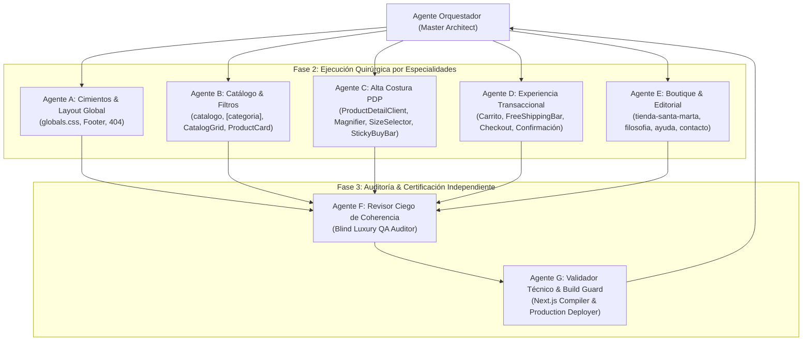

# 🏛️ PLAN DE HOMOGENEIZACIÓN INTEGRAL: QUIET LUXURY EN TODA LA WEB
**Módulo:** `WEB` (Vercel Headless Storefront)  
**Ruta Canónica:** `/Users/tomas/Library/CloudStorage/GoogleDrive-bautostudio@gmail.com/My Drive/VS/WEB`  
**Referencia Estética:** Lujo Silencioso (The Row, Loro Piana, Brunello Cucinelli, Toteme, Jacquemus)  
**Fecha:** 2026-09-29  
**Estado:** PENDIENTE DE AUTORIZACIÓN DEL USUARIO  
**Reglamento Rector:** `0. BAUTO ECOSYSTEM/.antigravityrules` & `BRAND_AND_DESIGN_SYSTEM.md`

---

## 1. PROPÓSITO Y OBJETIVO DEL AJUSTE
Tras el rediseño inicial de la portada (*Home*), la auditoría integral cruzada de dos agentes de investigación identificó que las demás ramas del sitio (`/catalogo`, `/catalogo/producto/[slug]`, `/carrito`, `/checkout/confirmacion`, `/tienda-santa-marta`, `/filosofia`, `/ayuda`, `/contacto`, `/not-found`) aún conservan patrones propios de un e-commerce genérico SaaS o dropshipping:
1. **"Cajas dentro de cajas":** Abuso de contenedores inflados con curvaturas masivas (`rounded-card` de 40px) y bordes grises (`border-bauto-carbon/5` o `/10`).
2. **Iconos de software en burbujas de colores:** Iconos Lucide encerrados en círculos de 48–56px en terracota o verde.
3. **Terracota y Naranjas estridentes en botones primarios y precios:** En lugar de la sobriedad del Negro Carbón (`#1C1917`) y la tipografía serena de lectura.
4. **Precios en tipografía de código de barras:** Empleo de `font-mono` (Rajdhani) para cifras y tallas.
5. **Lenguaje publicitario vulgarizador:** Presencia de la palabra *"VIP"* en 5 ocasiones, y sesgo restrictivo que reduce a BAUTO únicamente a "lino", ignorando su universo textil diverso (algodones nobles, rayón fluido, sedas).

**Meta:** Homogeneizar **toda la web** para que hable exactamente el mismo idioma visual de alta costura, preservando al 100% la lógica técnica y transaccional existente.

---

## 2. ARQUITECTURA MULTI-AGENTE (EQUIPO DE EJECUCIÓN)

Para asegurar rigor absoluto, evitar sobreescrituras y certificar el resultado, el trabajo se distribuye en una escuadra de **7 agentes especializados**:



1. **Agente Orquestador (Master Architect):** Coordina los bloques, verifica el cumplimiento de las `.antigravityrules` y reporta al usuario.
2. **Agente A (Cimientos & Layout Global):** Normaliza utilidades base en `globals.css` (clase canónica `.btn-pill-ghost`, sombras limpias, vidrio cálido) y limpia `Footer.tsx` y `not-found.tsx`.
3. **Agente B (Catálogo & Filtros):** Desmantela las cajas de 40px en `CatalogGrid.tsx`, transforma filtros en selectores tipográficos lineales y limpia las tarjetas en `ProductCard.tsx`.
4. **Agente C (Alta Costura PDP):** Rediseña la ficha de producto en `ProductDetailClient.tsx`, `TextureMagnifier.tsx`, `SizeSelector.tsx` y `StickyBuyBar.tsx`, estableciendo el botón en Negro Carbón absoluto y precios en tipografía serena.
5. **Agente D (Experiencia Transaccional):** Elimina contenedores dobles en `app/carrito/page.tsx`, estiliza `Carrito.tsx`, `FreeShippingBar.tsx`, inputs planos y moderniza `app/checkout/confirmacion/page.tsx` a un pliego numerado de alta costura.
6. **Agente E (Boutique & Editorial):** Refactoriza `tienda-santa-marta/page.tsx`, restaura los 3 pilares canónicos en `filosofia/page.tsx`, refina `ayuda/page.tsx` y erradica el widget verde y el copy "VIP" en `contacto/page.tsx`.
7. **Agente F (Revisor Ciego de Coherencia & Anti-Patrones):** Escanea los diffs resultantes con mirada escéptica para verificar que no sobreviva ninguna caja gris, icono en burbuja o verde estridente.
8. **Agente G (Validador Técnico & Build Guard):** Ejecuta `npm run build` en Next.js 14, valida que las 18 rutas generen `exit code 0`, verifica que no haya enlaces ni botones rotos y coordina el despliegue automático.

---

## 3. ANÁLISIS EN 3 CAPAS (SECUENCIAL Y OBLIGATORIO)

* **Capa 1 (Salud Técnica):**
  - Cero errores de sintaxis TypeScript/JSX.
  - Eliminación de imports huérfanos (`Phone`, `WeatherWidget`, `Heart`, `HelpCircle`, etc.).
  - Preservación íntegra de tipos `Product`, `CartItem`, payloads y rutas dinámicas.
* **Capa 2 (Lógica Funcional):**
  - Intacta la reactividad del estado Zustand (`useCartStore`) y `BroadcastChannel` multi-pestaña.
  - Intacta la reserva de Two-Phase Soft Lock en Redis (`/api/checkout/reserve`).
  - Intacta la generación de firmas SHA-256 de Wompi y el envío de checkout (`/api/checkout/wompi-session`).
  - Intactos los autocompletados de direcciones de Colombia (`/api/places/autocomplete`) y el cálculo de flete.
* **Capa 3 (Coherencia Estética & UI/UX):**
  - Máxima sobriedad: geometrías rectilíneas, fondos cálidos lino `#FAF9F6` y perla `#F2F0EB`.
  - Botones de compra primarios en Negro Carbón (`#1C1917`) con tipografía trackeada (`tracking-[0.2em]`).
  - Precios serenos en `font-body font-normal text-bauto-carbon` (erradicación de `font-mono` térmico).
  - Eliminación total de iconos Lucide en burbujas o pastillas de colores.

---

## 4. MATRICES DE RIESGO Y ACCIONES DE MITIGACIÓN

### A. Matriz de Riesgo de Interconexión
- **Nivel de Riesgo:** **BAJO** (módulo estrictamente interno).
- **Análisis:** Ningún cambio toca la estructura de Google Sheets (`Master DB`), la librería `BAUTOLib` en `0. PLATFORM`, ni los endpoints de `2. APPBAUTO`. Los payloads JSON enviados hacia `/api/webhooks/wompi` y `2. APPBAUTO` se mantienen con sus nombres de campo exactos.

### B. Matriz de Riesgo Estético
- **Nivel de Riesgo:** **CONTROLADO**.
- **Acción:** No se crean clases arbitrarias. Se formaliza `.btn-pill-ghost` en `app/globals.css` respetando la categoría 5 del manual de diseño oficial (`BRAND_AND_DESIGN_SYSTEM.md` §5.2).

---

## 5. TAREAS QUIRÚRGICAS DETALLADAS (ARCHIVO POR ARCHIVO)

### TAREA 1: Cimientos Globales & Pie de Página (Agente A)
* **Archivos:** `app/globals.css`, `components/navigation/Footer.tsx`, `app/not-found.tsx`.
* **Cambios:**
  1. `app/globals.css` (Líneas 28–30, 86–96, 107–126):
     - Agregar clase canónica `.btn-pill-ghost`:
       ```css
       .btn-pill-ghost {
         background: transparent;
         border: 1px solid rgba(28, 25, 23, 0.15);
         color: var(--text-primary);
         border-radius: var(--radius-pill);
         font-weight: 500;
         transition: all 0.2s ease;
       }
       .btn-pill-ghost:hover {
         background: rgba(28, 25, 23, 0.04);
         border-color: var(--text-primary);
       }
       ```
     - Suavizar sombra en `.btn-pill-primary` (`box-shadow: 0 2px 8px -1px rgba(184, 92, 56, 0.25)`).
     - Ajustar `--glass-bg: rgba(250, 249, 246, 0.75)`.
  2. `components/navigation/Footer.tsx` (Línea 90):
     - Sustituir `WhatsApp Concierge VIP` por `WhatsApp Concierge`.
  3. `app/not-found.tsx` (Líneas 19–67):
     - Sustituir brújula parpadeante en caja circular por un compás estático sutil (`stroke-[1.25]`).
     - Título *"404 — Fuera de Rumbo"* en `font-title`.
     - Botones `.btn-pill-primary` y `.btn-pill-glass` canónicos sin `shadow-elevated`.

---

### TAREA 2: Catálogo y Vitrina de Siluetas (Agente B)
* **Archivos:** `app/catalogo/page.tsx`, `app/catalogo/[categoria]/page.tsx`, `components/product/CatalogGrid.tsx`, `components/product/ProductCard.tsx`.
* **Cambios:**
  1. `app/catalogo/page.tsx` & `[categoria]/page.tsx`:
     - Sustituir *"Tipología Oficial"* por *"Siluetas de Autor"*.
     - Títulos en `font-title font-light tracking-wide text-bauto-carbon`.
     - Corregir copy para honrar el universo textil completo (algodón noble, rayón caribeño, lino, sedas).
  2. `components/product/CatalogGrid.tsx`:
     - Línea 65: Remover contenedor de 40px `rounded-card bg-bauto-perla/60 border` y sustituir por barra abierta con línea inferior `border-b border-bauto-carbon/10 pb-6`.
     - Líneas 68–89: Filtros transformados en texto plano en mayúsculas con subrayado activo (`border-b border-bauto-carbon`).
     - Líneas 95–125: Input de búsqueda y selector de orden rediseñados como campos de línea plana inferior.
     - Líneas 152–171: Estado vacío sin iconos masivos `Compass`, con tipografía poética y botón sobrio en Negro Carbón.
  3. `components/product/ProductCard.tsx`:
     - Líneas 46–50: Badges en etiquetas planas minimalistas sin sombras flotantes.
     - Línea 75: Hover suave de opacidad en título en lugar de virar a naranja estridente.
     - Líneas 82–84: Precios en tipografía de lectura `font-body font-normal text-bauto-carbon`.

---

### TAREA 3: Ficha de Producto de Alta Costura (PDP) (Agente C)
* **Archivos:** `components/product/TextureMagnifier.tsx`, `components/product/ProductDetailClient.tsx`, `components/product/SizeSelector.tsx`, `components/product/StickyBuyBar.tsx`, `components/product/SizeGuideModal.tsx`.
* **Cambios:**
  1. `components/product/TextureMagnifier.tsx`:
     - Líneas 42–68: Remover `rounded-card` de 40px y bordes grises de la imagen principal (proporción 3:4 limpia sin marco). Omitir botón pastilla con icono `ZoomIn`.
  2. `components/product/ProductDetailClient.tsx`:
     - Líneas 99–103: Miniaturas de galería rectilíneas limpias (`opacity-50 hover:opacity-100 border-bauto-carbon`).
     - Líneas 138–147: Título en `font-light`; precio en `font-body text-2xl text-bauto-carbon font-normal` (eliminar `font-mono text-bauto-terracota`).
     - Líneas 151–161: Badge de tienda física como bloque tipográfico con línea lateral en arena (`border-l-2 border-bauto-arena`).
     - Líneas 164–188: Ficha sensorial de tejido transformada en pliego con líneas finas divisorias (eliminar caja gris con `Sparkles`).
     - Líneas 217–234: Botón primario de compra en **Negro Carbón absoluto** (`bg-bauto-carbon text-bauto-nube hover:bg-bauto-carbon-soft uppercase tracking-[0.25em]`) sin icono `ShoppingBag` ni `shadow-elevated`.
     - Líneas 242–259: Enlace de asesoría concierge monocromático y sellos en prosa editorial sin camiones ni escudos.
  3. `components/product/SizeSelector.tsx`:
     - Líneas 41–104: Botones de talla rectilíneos en `font-body`; eliminar badges de urgencia artificial (`1 und`) y destellos `Sparkles`.
  4. `components/product/StickyBuyBar.tsx`:
     - Líneas 53–95: Línea superior hairline `border-t border-bauto-carbon/10`, precio en `font-body text-bauto-carbon` y botón de compra en Negro Carbón.
  5. `components/product/SizeGuideModal.tsx`:
     - Esquinas rectas (`rounded-sm`), sin iconos de software `Ruler`, y tallas en texto neutro.

---

### TAREA 4: Experiencia Transaccional: Carrito & Checkout (Agente D)
* **Archivos:** `app/carrito/page.tsx`, `components/cart/Carrito.tsx`, `components/cart/FreeShippingBar.tsx`, `components/cart/CartItemRow.tsx`, `components/cart/GiftCeremony.tsx`, `components/cart/AddressAutocomplete.tsx`, `app/checkout/confirmacion/page.tsx`.
* **Cambios:**
  1. `app/carrito/page.tsx`:
     - Líneas 158–177: Desmantelar cajas dobles `rounded-card bg-bauto-perla/60 border`; integrar elementos sobre el lienzo con separador hairline.
     - Líneas 193–262: Inputs de datos de envío estilizados como campos planos con línea inferior (`border-b border-bauto-carbon/20`).
     - Líneas 317–340: Total de compra en `font-body font-normal text-bauto-carbon`; botón de pago en **Negro Carbón** (`Proceder al Pago Seguro · $XXX`) sin `shadow-elevated`.
     - Líneas 344–352: Sello bancario transformado en nota al pie serena (adiós al escudo verde).
  2. `components/cart/Carrito.tsx` & `FreeShippingBar.tsx`:
     - Cabecera limpia sin pastillas térmicas; barra de envío de cortesía reducida a una línea hairline de 1.5px en Negro Carbón (eliminando porcentaje de gamificación).
  3. `components/cart/CartItemRow.tsx` & `GiftCeremony.tsx`:
     - Miniaturas sin bordes grises; dedicatoria de regalo estilizada como auténtico pliego de papel de algodón en *Lora Italic* (sin destellos `Sparkles` ni switches estilo iPhone).
  4. `components/cart/AddressAutocomplete.tsx`:
     - Input plano de línea inferior y menú desplegable limpio sin iconos naranjas.
  5. `app/checkout/confirmacion/page.tsx`:
     - Líneas 48–54: Eliminar círculo gigante con `CheckCircle2` y titular *"Wompi Aprobada"*; reemplazar por *"Pedido Confirmado · Taller Santa Marta"*.
     - Líneas 71–106: Stepper de círculos de colores animados sustituido por narrativa de alta costura numerada (`01, 02, 03, 04`).
     - Líneas 113–128: Botones en Negro Carbón y atención concierge sin el cliché *"VIP"*.

---

### TAREA 5: Páginas Editoriales, Institucionales & Boutique (Agente E)
* **Archivos:** `app/tienda-santa-marta/page.tsx`, `app/filosofia/page.tsx`, `app/ayuda/page.tsx`, `app/contacto/page.tsx`.
* **Cambios:**
  1. `app/tienda-santa-marta/page.tsx`:
     - Limpiar imports huérfanos (`Phone`, `WeatherWidget`).
     - Eliminar badges plásticos y punto pulsante (`animate-pulse`) sobre el mapa interactivo; sustituir por etiqueta fija de coordenadas tipográficas.
     - Sustituir botones de navegación GPS por enlaces de texto fino con punto medio (`Google Maps · Apple Maps · Waze`).
     - Erradicar iconos dentro de círculos de colores.
     - Sustituir copy de hotel ("Climatización Óptima") por narrativa sensorial de atelier caribeño.
  2. `app/filosofia/page.tsx`:
     - Limpiar import `Heart`.
     - Desmantelar las 3 cajas grises/amarillas con iconos de software (`Feather, Wind, Sparkles`).
     - Restaurar los **3 pilares canónicos del BAUTO Design System** (*Cuerpo Consciente*, *Movimiento del Trópico*, *Tejido de Reciprocidad*) con tipografía editorial de gran escala, numeración clásica (`01`, `02`, `03`) y narrativa textil completa.
  3. `app/ayuda/page.tsx`:
     - Limpiar import `HelpCircle`.
     - Desmantelar las 4 tarjetas encajonadas (`rounded-card`) con fondos perla y beige; estructurar las políticas como pliegos de *Client Services* con líneas horizontales divisorias.
     - Eliminar la tabla monospace con chulitos (`✓`) de pagos; reemplazar por etiquetas de texto limpio.
     - Eliminar WhatsApp verde `#25D366`.
  4. `app/contacto/page.tsx`:
     - Eliminar el banner verde estridente de WhatsApp (`bg-[#F0FDF4] border-[#BBF7D0]`).
     - Fusionar las 4 cajitas grises de la izquierda en un panel sobrio unificado.
     - Sustituir las 5 apariciones de *"VIP"* por *"Concierge de Autor"*, *"Asesoría de Taller"* y *"Cita en Boutique"*.
     - Vincular la constante oficial `BAUTO_WHATSAPP_PHONE`.

---

### TAREA 6: Auditoría Ciega de Coherencia & Compilación Técnica (Agentes F y G)
* **Agente F (Auditor Ciego):**
  - Barrido general de diffs con `git diff`.
  - Verificación estricta de erradicación de:
    - `rounded-card` innecesarios en componentes comerciales.
    - Iconos de software Lucide en círculos de colores.
    - Clases `shadow-elevated`.
    - Fuentes mono (`font-mono`) en precios de productos y totales.
    - Verdes chillones (`#25D366`, `#16A34A`) y la palabra *"VIP"*.
* **Agente G (Validador Técnico & Despliegue):**
  - Ejecutar `npm run build` en `VS/WEB`.
  - Certificar 18/18 rutas prerenderizadas y dinámicas con `exit code 0`.
  - Ejecutar `git commit` y `git push origin main` para disparo automático de Vercel.
  - Verificar respuesta HTTP 200 en `https://bauto-web.vercel.app`.
  - Actualizar `BAUTO_MEMORY.md` y `README.md`.

---

## 6. ESTÁNDAR DE ANOTACIÓN INLINE OBLIGATORIA
Cada archivo intervenido llevará el encabezado JSDoc reglamentario:
```typescript
/**
 * @BAUTO_REFACTOR 2026-09-29
 * @Modulo: WEB (Vercel Headless)
 * @Propósito: Homogeneización integral a Quiet Luxury y erradicación de patrones SaaS/dropshipping
 * @Capa: Estética / Funcional
 * @Riesgo_Evaluado: Controlado - Preservación de interactividad y contratos de API
 */
```

---

## 7. CRITERIOS DE ACEPTACIÓN
1. [ ] Todas las rutas de la web (`/`, `/catalogo`, `/catalogo/[categoria]`, `/catalogo/producto/[slug]`, `/carrito`, `/checkout/confirmacion`, `/tienda-santa-marta`, `/filosofia`, `/ayuda`, `/contacto`, `/not-found`) comparten la misma atmósfera de lujo silencioso.
2. [ ] Ninguna página contiene cajas grises infladas, iconos de software en círculos de colores ni el término *"VIP"*.
3. [ ] Todos los botones de compra primarios son Negro Carbón sobrio (`#1C1917`) y todos los precios se leen en tipografía serena.
4. [ ] La compilación `npm run build` genera cero errores de TypeScript y 18 rutas vivas.
5. [ ] El despliegue en Vercel responde con `HTTP 200` y queda asentado en `BAUTO_MEMORY.md`.

---

## 8. SOLICITUD DE AUTORIZACIÓN
Este plan está completamente formulado y alineado con las `.antigravityrules`.  
**¿Autorizas la ejecución inmediata de este plan por parte del equipo de agentes especializados?**
