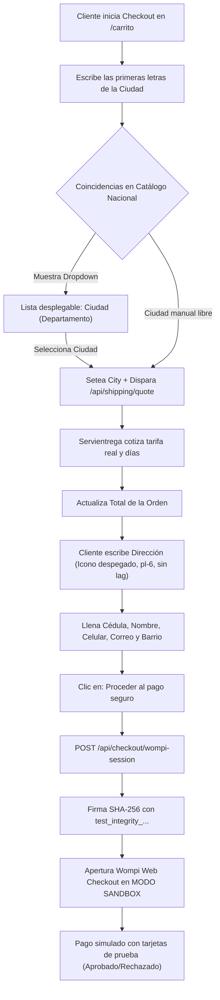

# PLAN: MODO SANDBOX WOMPI + AUTOCOMPLETADO PREDICTIVO DE CIUDAD + FIX ENTRADA DE DIRECCIÓN

**Fecha:** 2026-10-02  
**Módulo:** WEB (`bauto.com.co` / Next.js 14 Headless / Vercel)  
**Autor:** Antigravity Architect & Coder  
**Ubicación Canónica del Plan:** `WEB/PLAN_SANDBOX_AUTOCOMPLETE_DIRECCION.md`  
**Capas Involucradas:** Capa 1 (Técnica) + Capa 2 (Funcional) + Capa 3 (Estética Quiet Luxury)  
**Riesgo Evaluado:** Medio-Controlado (Ambiente de pasarela de pruebas y UX de captura de datos)

---

## 1. Contexto y Fuentes de Verdad

### A. Credenciales Oficiales de Wompi Sandbox (Modo Pruebas)
Capturadas del panel de desarrollador de Wompi de BAUTO:
*   **Llave Pública:** `pub_test_oZmlfe1Ze2vJE3qoZh0mclXPz05nectY`
*   **Llave Privada:** `prv_test_Nay4eyuaPeTkmn4MYs65f6HOGgkSPELx`
*   **Secreto de Eventos (Webhooks):** `test_events_htf1X4DL03OARXvNQ7lXuIBiSHWDzfRW`
*   **Secreto de Integridad (SHA-256):** `test_integrity_WJyAotiCVCNpFlqWOqorqfdE9fXJSPTN`
*   **URL de Eventos en Wompi (Webhook):** `https://bauto-web.vercel.app/api/webhooks/wompi`

### B. Requerimiento de Autocompletado de Ciudad (Cobertura Servientrega)
*   Servientrega cubre los 1.122 municipios de Colombia a través de sus códigos DANE.
*   Para evitar que el usuario deba adivinar qué escribir o sufra errores de tipeo, se implementa un **componente de búsqueda predictiva en tiempo real**:
    *   Base de datos normalizada con las ciudades principales y municipios de Colombia junto con su Departamento (ej: *Santa Marta (Magdalena)*, *Bogotá D.C.*, *Medellín (Antioquia)*, *Barranquilla (Atlántico)*, *Cali (Valle)*, *Bucaramanga (Santander)*, *Cartagena (Bolívar)*, *Pereira (Risaralda)*, *Manizales (Caldas)*, *Cúcuta (Norte de Santander)*, *Ibagué (Tolima)*, *Pasto (Nariño)*, *Villavicencio (Meta)*, *Montería (Córdoba)*, *Valledupar (Cesar)*, *Sincelejo (Sucre)*, *Popayán (Cauca)*, *Tunja (Boyacá)*, *Riohacha (La Guajira)*, *Armenia (Quindío)*, *Neiva (Huila)*, *Envigado (Antioquia)*, *Itagüí (Antioquia)*, *Bello (Antioquia)*, *Soledad (Atlántico)*, *Floridablanca (Santander)*, *Chía (Cundinamarca)*, *Soacha (Cundinamarca)*, *Rionegro (Antioquia)*, *Girardot (Cundinamarca)*, *Zipaquirá (Cundinamarca)*, *Dosquebradas (Risaralda)*, etc.).
    *   Al escribir las primeras 2 letras, se despliega una lista flotante con diseño sobrio Quiet Luxury (`bg-[#FAF9F6]`, borde hairline `#EAE7DF`, tipografía Jost).
    *   Al hacer clic o tap, se selecciona la ciudad, se cierra el menú y se dispara la cotización de Servientrega de inmediato.

### C. Requerimiento de Fix en la Entrada de Dirección
*   **Causa Raíz del Solapamiento:** En `components/cart/AddressAutocomplete.tsx`, el input tiene la clase `pl-0` mientras que el ícono `MapPin` está posicionado con `absolute left-0`. Esto causa que el texto del placeholder y las letras que escribe el usuario se rendericen encima del ícono.
*   **Causa Raíz de la Sensación de "Pegado" (Lag al escribir):** El componente sincronizaba un estado interno `query` con `value` a través de `useEffect` en cada render del padre, compitiendo además con un debounce de Google Places mock que re-escribía sugerencias de Santa Marta. Se optimiza a un control directo y fluido con respuesta instantánea a cada pulsación de tecla.

---

## 2. Tabla Detallada de Tareas (Archivo, Línea, Antes y Después)

| Tarea | Archivo | Líneas Aprox. | Estado Antes | Estado Después | Capa |
| :--- | :--- | :--- | :--- | :--- | :--- |
| **T1: Llaves Sandbox** | `.env.local` | L1-L10 | Llaves `prod_` de Wompi activas. | Inyección de las llaves oficiales `pub_test_oZmlfe1Ze2vJE3qoZh0mclXPz05nectY`, `prv_test_Nay4eyuaPeTkmn4MYs65f6HOGgkSPELx`, `test_events_htf1X4DL03OARXvNQ7lXuIBiSHWDzfRW` y `test_integrity_WJyAotiCVCNpFlqWOqorqfdE9fXJSPTN`. | Capa 1 |
| **T2: Fallbacks en Servidor** | `app/api/checkout/wompi-session/route.ts` | L100-L104 | Fallbacks predeterminados apuntaban a `pub_prod_...` y `prod_integrity_...`. | Fallbacks apuntando a `pub_test_oZmlfe1Ze2vJE3qoZh0mclXPz05nectY` y `test_integrity_WJyAotiCVCNpFlqWOqorqfdE9fXJSPTN` para garantizar que la firma SHA-256 coincida con el entorno de pruebas. | Capa 1 |
| **T3: Fix Solapamiento y Lag Dirección** | `components/cart/AddressAutocomplete.tsx` | L100-L120 | `<input className="... pl-0 pr-8 ...">` que solapa el ícono `<MapPin className="absolute left-0 ...">` y lag en `setQuery`. | `<input className="... pl-6 pr-8 ...">` dejando 24px limpios para el ícono; sincronización síncrona sin lag ni cursor saltarín; sugerencias flotantes no invasivas. | Capa 3 |
| **T4: Autocompletado Predictivo Ciudad** | `app/carrito/page.tsx` | L255-L280 | `<input type="text" value={city} ...>` simple sin catálogo de opciones ni autocompletado interactivo. | Selector predictivo con autocompletado en vivo de municipios y departamentos de Colombia; dropdown sutil estilo BAUTO con teclado y táctil; selección automática y cotización reactiva con Servientrega. | Capa 2 & 3 |

---

## 3. Matriz de Riesgo de Interconexión y Riesgo Estético

### A. Riesgo de Interconexión
*   **Bajo Riesgo:** Los cambios en `AddressAutocomplete.tsx` y el input de ciudad en `page.tsx` son interfaces de usuario del cliente; el contrato de datos enviado a `/api/checkout/wompi-session` se mantiene intacto (`shippingCity`, `shippingAddress`, `customerBarrio`, etc.).
*   **Control de Integridad Wompi:** La firma SHA-256 en el servidor se generará con `test_integrity_WJyAotiCVCNpFlqWOqorqfdE9fXJSPTN`. Al hacer clic en pagar, Wompi Checkout Web abrirá directamente con el banner *"Modo de pruebas"* y aceptará las tarjetas de testing de Bancolombia/Wompi sin cobro real.

### B. Riesgo Estético
*   **Tipografía y Tokens:** Se utiliza estrictamente `font-light` de Jost, tracking `[0.03em]`, colores oficiales `#1C1917` (Negro Carbón) y `#78716C` (Gris Piedra), con líneas divisorias hairline `#EAE7DF`. Cero gradientes genéricos o sombras toscas.

---

## 4. Diagrama de Flujo (Mermaid)

---

## 5. Super Prompts de Ejecución Multi-Agente

### Agente 1: Credenciales Sandbox y Servidor Wompi
*   **Misión:** Actualizar `.env.local` con las 4 llaves `test_` de Wompi y actualizar los fallbacks del endpoint `app/api/checkout/wompi-session/route.ts`. Validar que la cadena de integridad SHA-256 utilice el secreto de pruebas.

### Agente 2: Corrección Ergonómica de Dirección (`AddressAutocomplete.tsx`)
*   **Misión:** Corregir el solapamiento del ícono `MapPin` aplicando `pl-6`, eliminar la desincronización de estado para que la escritura sea totalmente fluida e instantánea, y asegurar que el dropdown no bloquee la interacción.

### Agente 3: Componente de Autocompletado Predictivo de Ciudades (`app/carrito/page.tsx`)
*   **Misión:** Implementar la base de datos de municipios y departamentos de Colombia, el buscador predictivo con dropdown accesible (click outside, teclado, touch) y la activación inmediata de la cotización con Servientrega al seleccionar una opción.

---

## 6. Criterio de Verificación de Cierre
1.  **Verificación de Dirección:** Escribir una dirección en el campo correspondiente y certificar que el texto no se solapa con el ícono del pin y que responde a cada tecla sin trabas ni demoras.
2.  **Verificación de Ciudad:** Escribir "Med", "Bog", "San", "Car", etc., y comprobar que aparezca el listado desplegable con el departamento correspondiente. Al seleccionar una ciudad, comprobar que Servientrega cotice de inmediato el flete real.
3.  **Verificación de Wompi Sandbox:** Presionar el botón de pago y certificar que la pantalla de Wompi abra indicando *"Ambiente de pruebas"* / *"Sandbox"*, permitiendo completar una transacción con tarjeta ficticia.
4.  **Compilación Next.js:** `npx next build` debe compilar las 22 rutas con 0 errores de TypeScript antes de hacer commit y despliegue a Vercel.
