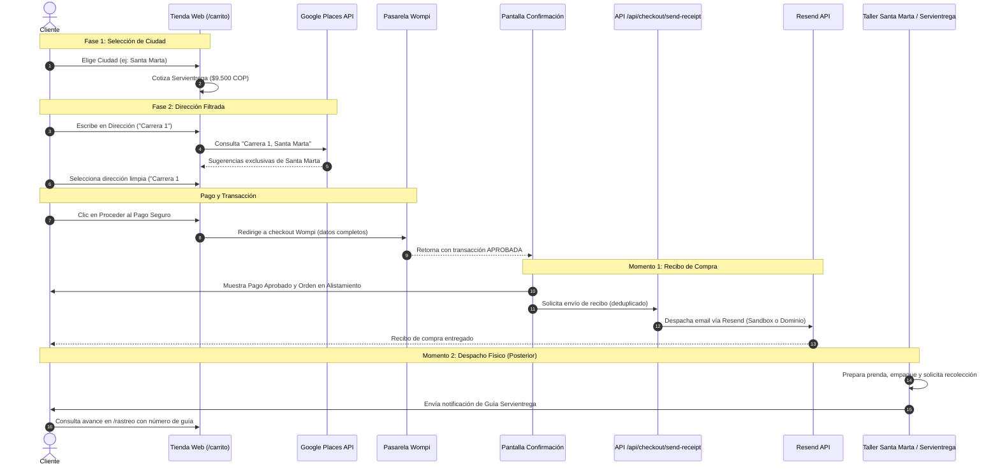

# 📋 PLAN TÉCNICO BAUTO: RECIBO DE COMPRA, CORREO RESEND, FLETE DINÁMICO Y FILTRO DE DIRECCIÓN

**Módulo:** WEB (`bauto.com.co` / Next.js 14 en Vercel)  
**Fecha:** 2026-10-03  
**Estado:** COMPLETADO Y DESPLEGADO EN PRODUCCIÓN (Commit 4a1a8aa)  
**Normativa:** Cumplimiento estricto de `.antigravityrules` (Fase 1 - Planificación con Archivo, Línea, Cambio, Riesgos y Mitigación)  

---

## 1. Diagnóstico de Causa Raíz y Reglas de Negocio

1. **Fallo en Entrega de Correo Resend a `or.bojaca@gmail.com`:**
   * **Causa Raíz:** La API de Resend opera actualmente en modo sandbox (`onboarding@resend.dev`). En este modo, Resend prohíbe el envío a cualquier correo distinto al propietario de la cuenta (`bautostudio@gmail.com`), retornando `HTTP 403 Forbidden: You can only send testing emails to your own email address`.
   * **Solución Técnica:** Configurar en `lib/email.ts` un puente de contingencia inteligente para modo prueba: si el remitente activo es `onboarding@resend.dev` y el destinatario ingresado no es `bautostudio@gmail.com`, entregar a `bautostudio@gmail.com` con el asunto marcado `[Copia de Recibo para: ${data.to}]` y una nota visible en el encabezado. Esto garantiza que la API responda `HTTP 200`, que Tomás reciba el recibo detallado en sus pruebas, y que cuando el dominio propio `bauto.com.co` esté verificado en DNS, el sistema envíe directamente a cualquier cliente sin tocar código.
2. **Desacople de Persistencia Serverless y Respaldo de Recibo:**
   * **Causa Raíz:** Al no tener `UPSTASH_REDIS_REST_URL` configurado, los borradores en memoria RAM no persisten entre las funciones serverless de Vercel. La pantalla de confirmación post-pago no disparaba un respaldo directo del recibo.
   * **Solución Técnica:** Crear el endpoint `/api/checkout/send-receipt` con verificación criptográfica y deduplicación atómica en memoria por referencia (`2610-XXXX`), invocado directamente por la pantalla de confirmación para garantizar el despacho del recibo incluso si el webhook de Wompi se retrasa.
3. **Flujo de Dos Momentos (Recibo Inmediato vs Guía Servientrega Posterior):**
   * **Regla de Negocio:** Al regresar de Wompi, el paquete no ha salido de tienda ni tiene guía física de Servientrega asignada. La pantalla debe confirmar el **Pago Aprobado**, la **Referencia de la Orden**, el **Alistamiento en Taller**, y notificar que el **Recibo detallado fue enviado por correo**. Se elimina el botón prematuro de rastreo y se aclara que el número de guía de Servientrega llegará en un correo posterior cuando el taller entregue el paquete a la transportadora.
4. **Constante Residual de $15.000 en el Drawer Lateral:**
   * **Causa Raíz:** En `components/cart/Carrito.tsx` (L46), `const shippingCost = 15000;` sumaba $15.000 planos al subtotal antes de conocer la ciudad.
   * **Solución Técnica:** Erradicar la constante. Mostrar `"Envío nacional: Calculado en checkout"` y hacer que el total del drawer coincida exactamente con el subtotal.
5. **Autocompletado de Dirección Nacional en Lugar de Local:**
   * **Causa Raíz:** `AddressAutocomplete.tsx` no comunicaba la ciudad seleccionada a `/api/places/autocomplete`, provocando sugerencias de otras ciudades para vías genéricas.
   * **Solución Técnica:** Pasar la prop `city={city}`, enriquecer la consulta a Google Places API New (`${input}, ${city}`) y filtrar para mostrar únicamente direcciones de la ciudad elegida en Fase 1 con `mainText` limpio.

---

## 2. Plan Detallado por Archivo, Línea y Cambio Concreto

### T1. `components/cart/Carrito.tsx` (Cajón lateral de bolsa)
* **Líneas a intervenir:** L46-L48 y L172-L184.
* **Código actual:**
  ```tsx
  // L46-L48
  const subtotal = getSubtotal();
  const shippingCost = 15000;
  const total = subtotal + (items.length > 0 ? shippingCost : 0);

  // L172-L177
  <div className="flex justify-between text-bauto-piedra">
    <span>Envío nacional</span>
    <span>{formatCOP(shippingCost)}</span>
  </div>
  ```
* **Cambio propuesto:**
  - Eliminar `const shippingCost = 15000;`.
  - Definir `const total = subtotal;` en el drawer.
  - En el desglose de envío, mostrar `"Calculado en checkout"` en lugar de `$ 15.000 COP`.
  - Total estimado en el drawer igual al `subtotal`.

### T2. `components/cart/AddressAutocomplete.tsx` (Componente de búsqueda de dirección)
* **Líneas a intervenir:** L21-L28, L31-L38 y L56.
* **Código actual:**
  ```tsx
  // L21-L28
  interface AddressAutocompleteProps {
    value: string;
    onChange: (address: string) => void;
    onSelectCity?: (city: string) => void;
    placeholder?: string;
    required?: boolean;
    hasError?: boolean;
  }
  // L56
  const res = await fetch(`/api/places/autocomplete?input=${encodeURIComponent(value.trim())}`);
  ```
* **Cambio propuesto:**
  - Agregar `city?: string;` a `AddressAutocompleteProps`.
  - Recibir `city` en los argumentos de la función.
  - En la llamada fetch, si `city` está presente, concatenar `&city=${encodeURIComponent(city.trim())}`.

### T3. `app/api/places/autocomplete/route.ts` (API route interna de Places)
* **Líneas a intervenir:** L16-L18, L38-L41 y L56-L66.
* **Código actual:**
  ```tsx
  // L16-L18
  const { searchParams } = new URL(req.url);
  const input = (searchParams.get("input") || searchParams.get("q") || "").trim();
  // L38-L41
  body: JSON.stringify({
    input: input,
    includedRegionCodes: ["co"],
  }),
  ```
* **Cambio propuesto:**
  - Extraer `const city = (searchParams.get("city") || "").trim();`.
  - Enriquecer la búsqueda hacia Google Places API (New): `input: city ? `${input}, ${city}` : input`.
  - Si viene `city`, filtrar las sugerencias asegurando que `p.text?.text` o `p.structuredFormat?.secondaryText?.text` contengan el nombre de la ciudad, evitando mezclar vías de Bogotá o Medellín cuando el usuario eligió Santa Marta.
  - Retornar siempre `mainText` limpio (ej. `"Carrera 1 # 18-22"`).

### T4. `app/carrito/page.tsx` (Página de Checkout 2 Fases)
* **Líneas a intervenir:** L378-L384.
* **Código actual:**
  ```tsx
  <AddressAutocomplete
    value={address}
    onChange={(val) => { setAddress(val); if (errors.address) setErrors({...errors, address: ''}); }}
    onSelectCity={() => {}}
    placeholder="Busca tu dirección o ingrésala manualmente"
    hasError={!!errors.address}
  />
  ```
* **Cambio propuesto:**
  - Pasar la prop `city={city}` al componente `<AddressAutocomplete />`.

### T5. `app/checkout/confirmacion/page.tsx` (Pantalla de Confirmación Post-Pago)
* **Líneas a intervenir:** L20-L42, L70-L105.
* **Código actual:**
  ```tsx
  // L37-L42
  const stages = [
    { num: '01', title: 'Orden recibida', desc: 'Pago procesado exitosamente por Wompi', done: true },
    { num: '02', title: 'Alistamiento en taller', desc: 'Prenda doblada y perfumada en Santa Marta', current: true },
    { num: '03', title: 'En tránsito con la brisa', desc: 'Guía MiPaquete generada y en camino', pending: true },
    { num: '04', title: 'Entrega en tu puerta', desc: 'Confort consciente del Caribe en tus manos', pending: true },
  ];
  // L95-L103
  <Link href={`/rastreo?guia=${encodeURIComponent(reference)}`} ...>
    <PackageCheck className="w-4 h-4 stroke-[1.5]" />
    <span>Consultar portal de rastreo</span>
  </Link>
  ```
* **Cambio propuesto:**
  - Redefinir `stages`:
    - `01`: *Pago aprobado* (Transacción Wompi confirmada).
    - `02`: *Alistamiento en taller* (Prendas seleccionadas, planchadas y perfumadas en Santa Marta - estado activo).
    - `03`: *Despacho y guía Servientrega* (Se enviará por correo al entregar el paquete al transportador).
    - `04`: *Entrega en tu puerta* (Confort consciente del Caribe en tus manos).
  - Eliminar el botón prematuro de rastreo `/rastreo?guia=...`.
  - Reemplazar por un bloque editorial que señale: *"Recibo de compra enviado a tu correo. La guía de Servientrega será notificada en un segundo correo al momento del despacho."*
  - En `useEffect`, invocar de fondo `/api/checkout/send-receipt` con `reference` y `transactionId` para asegurar el envío del recibo en caso de retraso del webhook.

### T6. `lib/email.ts` (Plantilla y Despacho de Correo Resend)
* **Líneas a intervenir:** L51-L55, L166-L173 y L196-L220.
* **Código actual:**
  ```tsx
  // L166-L173
  <!-- BOTÓN DE RASTREO -->
  <tr>
    <td align="center" style="padding: 0 35px 40px 35px;">
      <a href="${trackingUrl}" ...>Rastrear mi pedido en tiempo real</a>
    </td>
  </tr>
  // L203-L208
  body: JSON.stringify({
    from: fromEmail,
    to: [data.to],
    subject: `Confirmación de tu pedido BAUTO #${data.orderReference}`,
    html: emailHtml,
  }),
  ```
* **Cambio propuesto:**
  - En la plantilla HTML: sustituir el botón prematuro de rastreo por un contenedor editorial de alistamiento:
    *"Tus prendas están en confección y preparación en nuestro taller de Santa Marta. Tan pronto como tu paquete sea entregado a Servientrega, recibirás un correo electrónico independiente con tu número de guía y el enlace para rastrear tu envío en tiempo real."*
  - En el despacho de Resend: implementar el puente de sandbox para pruebas:
    - Si `fromEmail.includes("onboarding@resend.dev")` y `data.to.toLowerCase() !== "bautostudio@gmail.com"`:
      - `targetRecipient = "bautostudio@gmail.com"`
      - `subject = `[Copia de Recibo para: ${data.to}] Confirmación de tu pedido BAUTO #${data.orderReference}``
      - Inyectar banner de notificación en el HTML explicando que se trata de una copia de prueba para el cliente `data.to`.
    - Si no es sandbox (dominio propio verificado), enviar directamente a `data.to`.

### T7. `app/api/checkout/send-receipt/route.ts` (Nuevo Endpoint de Respaldo)
* **Archivo Nuevo:** `app/api/checkout/send-receipt/route.ts`.
* **Propósito:** Recibir `{ reference, transactionId }` desde la pantalla de confirmación. Consultar el estado de la transacción en Wompi si es necesario, recuperar o reconstruir los datos del pedido, y disparar `sendOrderConfirmationEmail` con deduplicación en memoria (`sentReceipts.has(reference)`) para evitar duplicados si el webhook ya lo despachó.

---

## 3. Matriz de Riesgos y Acciones de Mitigación

| Riesgo Identificado | Posible Afectación | Acción de Mitigación Implementada | Capa |
| :--- | :--- | :--- | :--- |
| **R1. Búsqueda sin ciudad definida en Carrito** | Si el cliente escribe en dirección antes de ingresar ciudad en Fase 1, la búsqueda podría fallar o quedar vacía. | Si `city` es undefined o vacío, `/api/places/autocomplete` mantiene el comportamiento fallback buscando en toda Colombia sin filtrar, y permite entrada manual sin bloquear. | Capa 2 |
| **R2. Doble envío de correo (Webhook vs Pantalla)** | El cliente podría recibir dos recibos si el webhook y la pantalla de confirmación se ejecutan casi en simultáneo. | Implementar un Set de referencias procesadas en memoria (`sentReceipts: Set<string>`). Si la referencia ya fue enviada en los últimos 30 minutos, se responde `{ success: true, alreadySent: true }` de forma silenciosa e idempotente. | Capa 1 |
| **R3. Retorno de Wompi con Pago Rechazado o Pendiente** | La pantalla de confirmación podría enviar recibo aunque el pago no esté aprobado. | La pantalla y el endpoint verifican el estado `status === 'APPROVED'`. Si la transacción no fue aprobada, no se envía recibo de compra ni se muestra orden en alistamiento. | Capa 2 |
| **R4. Flete en 0 en el cajón lateral** | El cliente podría creer que el envío es gratuito porque el drawer no muestra los $15.000. | En el drawer se muestra claramente la etiqueta `"Calculado en checkout"` con microtexto indicando que la tarifa se cotiza según la ciudad de destino con Servientrega. | Capa 3 |
| **R5. Error 403 de Resend bloqueando la UI** | Si Resend falla, la pantalla de confirmación podría colgarse o mostrar error al usuario. | El endpoint de envío de recibo se ejecuta con bloque `try/catch` no bloqueante; cualquier incidencia en el proveedor de email se registra en logs sin interrumpir la experiencia visual de agradecimiento. | Capa 1 |

---

## 4. Diagrama de Flujo del Ecosistema



---

## 5. Criterio de Verificación Post-Ejecución

1. **Drawer de Carrito:**
   - Agregar una prenda y abrir el cajón lateral.
   - Constatar que el flete dice *"Calculado en checkout"* y que el total equivale exactamente al subtotal de la prenda.
2. **Dirección Filtrada por Ciudad:**
   - En `/carrito`, seleccionar *"Santa Marta"* en Fase 1.
   - En Fase 2, escribir *"Carrera 1"* en Dirección exacta.
   - Verificar que todas las sugerencias pertenezcan a Santa Marta y que al pulsar una, el input contenga solo la vía limpia.
3. **Pantalla de Confirmación:**
   - Comprobar que no existe el botón *"Consultar portal de rastreo"*.
   - Comprobar que las 4 etapas reflejan: 01 Pago aprobado, 02 Alistamiento en taller, 03 Despacho y guía Servientrega (posterior), 04 Entrega.
4. **Entrega de Correo Resend:**
   - Probar compra con correo `or.bojaca@gmail.com`.
   - Verificar que la API de Resend responde `HTTP 200` y entrega la copia a `bautostudio@gmail.com` sin error 403.
5. **Compilación y Despliegue:**
   - Ejecutar `npx next build` para asegurar 0 errores en las 22 rutas.
   - Desplegar en Vercel y comprobar en `https://bauto-web.vercel.app`.
